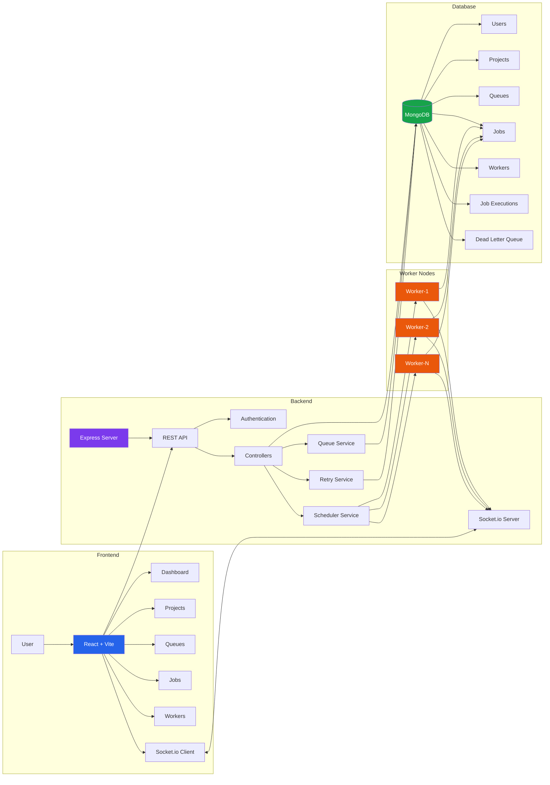

# SmartScheduler

A distributed job scheduling platform that enables reliable background job execution, queue management, worker monitoring, and real-time analytics through an interactive dashboard.

---

# 1. Project Title & Tagline

**SmartScheduler:** A full-stack distributed job scheduling platform built using React, Node.js, Express, MongoDB, and Socket.IO for reliable asynchronous job processing and real-time system monitoring.

---

# 2. System Architecture




# 3. Key Features

- Secure user authentication
- Project management
- Queue management
- Background job scheduling
- Distributed worker simulation
- Real-time job processing
- Live dashboard with Socket.IO
- Interactive analytics using Recharts
- Worker monitoring
- Job status tracking
- RESTful API architecture
- MongoDB data persistence
- Responsive modern user interface

---

# 4. Tech Stack

### Frontend

- React.js
- Vite
- Tailwind CSS
- React Router
- Axios
- React Icons
- Recharts
- Socket.IO Client

### Backend

- Node.js
- Express.js
- Socket.IO
- JWT Authentication
- Mongoose

### Database

- MongoDB

### Real-Time Communication

- Socket.IO

### Development Tools

- Git
- GitHub
- Postman
- Visual Studio Code

---
  
# 5. Project Structure

```text
SmartScheduler/
│
├── backend/
│   │
│   ├── config/
│   │   ├── db.js
│   │   
│   │
│   ├── controllers/
│   │   ├── authController.js
│   │   ├── dashboardController.js
│   │   ├── jobController.js
│   │   ├── projectController.js
│   │   ├── queueController.js
│   │   └── workerController.js
│   │
│   ├── middleware/
│   │   ├── auth.js
│   │   ├── errorMiddleware.js
│   │   ├── roleMiddleware.js
│   │   └── validateRequest.js
│   │
│   ├── models/
│   │   ├── DeadLetterJob.js
│   │   ├── Job.js
│   │   ├── JobExecution.js
│   │   ├── Project.js
│   │   ├── Queue.js
│   │   ├── User.js
│   │   └── Worker.js
│   │
│   ├── routes/
│   │   ├── authRoutes.js
│   │   ├── dashboardRoutes.js
│   │   ├── jobRoutes.js
│   │   ├── projectRoutes.js
│   │   ├── queueRoutes.js
│   │   └── workerRoutes.js
│   │
│   ├── services/
│   │   ├── jobService.js
│   │   ├── queueService.js
│   │   ├── retryService.js
│   │   ├── schedulerService.js
│   │   └── workerService.js
│   │
│   ├── workers/
│   │   ├── heartbeatMonitor.js
│   │   ├── jobProcessor.js
│   │   ├── startWorker.js
│   │   └── workerRunner.js
│   │
│   ├── jobs/
│   │   ├── jobClaiming.js
│   │   └── jobDispatcher.js
│   │
│   ├── utils/
│   │   ├── backoff.js
│   │   ├── cronParser.js
│   │   ├── logger.js
│   │   └── responseHandler.js
│   │
│   ├── app.js
│   ├── server.js
│   ├── package.json
│   └── .env
│
├── frontend/
│   │
│   ├── public/
│   │
│   ├── src/
│   │   │
│   │   ├── assets/
│   │   │
│   │   ├── components/
│   │   │   ├── AdminRoute.jsx
│   │   │   ├── JobsLineChart.jsx
│   │   │   ├── JobsPieChart.jsx
│   │   │   ├── ProtectedRoute.jsx
│   │   │   ├── Sidebar.jsx
│   │   │   └── WorkerBarChart.jsx
│   │   │
│   │   ├── layouts/
│   │   │
│   │   ├── pages/
│   │   │   ├── Dashboard.jsx
│   │   │   ├── Jobs.jsx
│   │   │   ├── Login.jsx
│   │   │   ├── Projects.jsx
│   │   │   ├── Queues.jsx
│   │   │   ├── Register.jsx
│   │   │   └── Workers.jsx
│   │   │
│   │   ├── services/
│   │   │   └── api.js
│   │   │
│   │   ├── App.jsx
│   │   └── main.jsx
│   │
│   ├── .gitignore
│   ├── eslint.config.js
│   ├── index.html
│   ├── package.json
│   ├── package-lock.json
│   ├── README.md
│   └── vite.config.js
│
├── .gitignore
├── README.md
└── LICENSE
```
# 6. Project Goal

The objective of SmartScheduler is to simulate a production-ready distributed job scheduling system capable of handling asynchronous background tasks reliably while providing administrators with complete visibility into job execution, worker activity, and queue performance through a modern real-time dashboard.

The project demonstrates concepts including:

- Distributed Systems
- Background Processing
- Queue Management
- Worker Scheduling
- Real-Time Communication
- REST API Design
- Database Design
- Frontend Dashboard Development

# 7. API Documentation

## Base URL

```
http://localhost:5000/api
```

---

# Authentication

## Register

**POST** `/auth/register`

### Request

```json
{
  "name": "John",
  "email": "john@example.com",
  "password": "password123"
}
```

### Response

```json
{
  "message": "User registered successfully"
}
```

---

## Login

**POST** `/auth/login`

### Request

```json
{
  "email": "john@example.com",
  "password": "password123"
}
```

### Response

```json
{
  "token": "JWT_TOKEN"
}
```

---

# Projects

## Get All Projects

**GET** `/projects`

Authorization: Bearer Token

---

## Create Project

**POST** `/projects`

```json
{
  "name": "E-Commerce Platform",
  "description": "Handles order processing jobs"
}
```

---

## Update Project

**PUT** `/projects/:id`

---

## Delete Project

**DELETE** `/projects/:id`

---

# Queues

## Get Queues

**GET** `/queues`

---

## Create Queue

**POST** `/queues`

```json
{
  "name": "Email Queue",
  "projectId": "PROJECT_ID"
}
```

---

## Delete Queue

**DELETE** `/queues/:id`

---

# Jobs

## Get Jobs

**GET** `/jobs`

---

## Create Job

**POST** `/jobs`

```json
{
  "queueId": "QUEUE_ID",
  "payload": {
      "email":"user@gmail.com"
  }
}
```

---

## Retry Job

**POST** `/jobs/:id/retry`

---

## Delete Job

**DELETE** `/jobs/:id`

---

# Workers

## Get Workers

**GET** `/workers`

---

## Register Worker

**POST** `/workers`

---

## Update Worker Status

**PATCH** `/workers/:id`

---

# Dashboard

## Dashboard Statistics

**GET** `/dashboard`

### Response

```json
{
  "stats": {
    "projectCount": 5,
    "queueCount": 7,
    "totalJobs": 200,
    "completedJobs": 180,
    "queuedJobs": 10,
    "runningJobs": 10
  }
}
```

---

# Socket.IO Events

| Event | Description |
|--------|-------------|
| job:created | New job added |
| job:running | Job execution started |
| job:completed | Job completed |
| job:failed | Job failed |
| worker:heartbeat | Worker heartbeat |

# 8. Source Code Setup Instructions

## Prerequisites

Install the following software:

- Node.js (v18 or later)
- MongoDB
- Git
- Visual Studio Code

---

## Clone Repository

```bash
git clone https://github.com/Nikita-Saxena391/SmartScheduler-Distributed-Job-Scheduler.git

cd SmartScheduler
```

---

## Backend Setup

```bash
cd backend

npm install
```

Create a `.env` file.

Example:

```env
PORT=5000

MONGO_URI=your_mongodb_connection

JWT_SECRET=your_secret_key
```

Start backend:

```bash
npm run dev
```

---

## Frontend Setup

```bash
cd frontend

npm install

npm run dev
```

---

## Running the Application

Backend

```
http://localhost:5000
```

Frontend

```
http://localhost:5173
```

---

## Login

Register a new account.

Login using the registered credentials.

---

## Features

- Authentication
- Projects
- Queues
- Jobs
- Workers
- Dashboard
- Socket.IO Live Updates
- Recharts Analytics

---

## Deployment

Frontend can be deployed using:

- Vercel
- Netlify

Backend can be deployed using:

- Render
- Railway

Database:

- MongoDB Atlas

---

## Environment Variables

Backend

```
PORT=
MONGO_URI=
JWT_SECRET=
```

Frontend

```
VITE_API_URL=
```

# 9. Design Decisions

## 1. React + Vite

Chosen for fast development, lightweight builds, and excellent developer experience.

---

## 2. Express.js

Provides a simple and modular REST API architecture suitable for distributed job scheduling.

---

## 3. MongoDB

MongoDB was selected because job payloads are dynamic and schema flexibility allows different job types without frequent schema migrations.

Trade-off:
- Less relational consistency than SQL databases.
- Better flexibility for asynchronous job metadata.

---

## 4. Socket.IO

Used instead of polling to provide real-time dashboard updates.

Benefits:

- Lower latency
- Better user experience
- Reduced unnecessary API requests

Trade-off:

Maintaining WebSocket connections increases server memory usage.

---

## 5. JWT Authentication

JWT provides stateless authentication and easy frontend integration.

Trade-off:

Token invalidation requires additional implementation if logout across devices is needed.

---

## 6. Background Workers

Workers simulate distributed processing by executing jobs independently.

Benefits:

- Scalability
- Separation of concerns
- Easier fault isolation

---

## 7. Retry Mechanism

Failed jobs are retried before moving to the Dead Letter Queue.

Benefits:

- Improves reliability
- Handles transient failures

Trade-off:

Additional processing time for repeatedly failing jobs.

---

## 8. Recharts Dashboard

Provides visual monitoring of:

- Job distribution
- Worker performance
- Queue statistics

without requiring additional dashboard frameworks.

# 10. Automated Testing

The following critical functionalities were identified for automated testing.

---

## Authentication

✔ User Registration

- Valid registration
- Duplicate email validation
- Password hashing

✔ User Login

- Valid credentials
- Invalid credentials
- JWT generation

---

## Projects

- Create Project
- Update Project
- Delete Project
- Authorization validation

---

## Queues

- Queue creation
- Queue deletion
- Queue belongs to project

---

## Jobs

- Job creation
- Job scheduling
- Retry failed job
- Delete job
- Status updates

---

## Workers

- Worker registration
- Worker heartbeat
- Worker availability
- Worker status updates

---

## Dashboard

- Dashboard statistics
- Socket.IO real-time updates
- Job counters

---

## Suggested Testing Tools

- Jest
- Supertest
- Postman Collections

---

## Example Test

```
POST /api/auth/login

Expected Status: 200 OK

Returns JWT Token
```

---

Future improvements include integration testing and load testing using Artillery.
