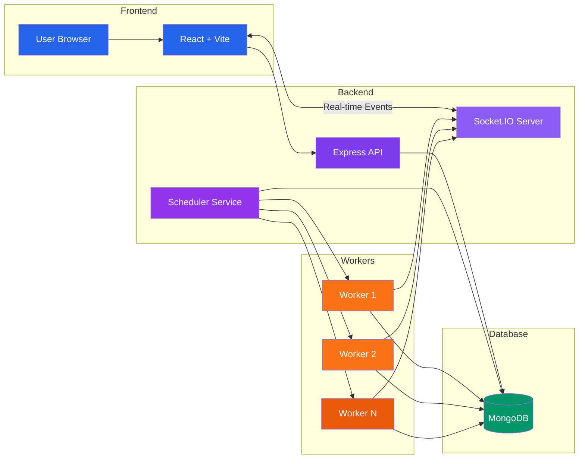

# SmartScheduler

A distributed job scheduling platform that enables reliable background job execution, queue management, worker monitoring, and real-time analytics through an interactive dashboard.

---

# 1. Project Title & Tagline

**SmartScheduler:** A full-stack distributed job scheduling platform built using React, Node.js, Express, MongoDB, and Socket.IO for reliable asynchronous job processing and real-time system monitoring.

---

# 2. Problem Statement

Modern applications rely on background jobs for tasks such as email notifications, report generation, file processing, payment processing, and scheduled operations. Managing these jobs efficiently becomes challenging as the system scales.

Traditional approaches often suffer from:

- Lack of centralized job monitoring
- Poor worker utilization
- Limited scalability
- Delayed status updates
- Difficulty tracking job execution
- No real-time visibility into system performance

SmartScheduler addresses these challenges by providing a centralized platform for managing projects, queues, jobs, and workers while delivering real-time monitoring through an interactive dashboard.

---
## System Architecture



# 4. Key Features

- Secure user authentication
- Project management
- Queue management
- Background job scheduling
- Distributed worker simulation
- Real-time job processing
- Live dashboard with Socket.IO
- Interactive analytics using Recharts
- Worker monitoring
- Job status tracking
- RESTful API architecture
- MongoDB data persistence
- Responsive modern user interface

---

# 5. Tech Stack

### Frontend

- React.js
- Vite
- Tailwind CSS
- React Router
- Axios
- React Icons
- Recharts
- Socket.IO Client

### Backend

- Node.js
- Express.js
- Socket.IO
- JWT Authentication
- Mongoose

### Database

- MongoDB

### Real-Time Communication

- Socket.IO

### Development Tools

- Git
- GitHub
- Postman
- Visual Studio Code

---

# 6. Project Goal

The objective of SmartScheduler is to simulate a production-ready distributed job scheduling system capable of handling asynchronous background tasks reliably while providing administrators with complete visibility into job execution, worker activity, and queue performance through a modern real-time dashboard.

The project demonstrates concepts including:

- Distributed Systems
- Background Processing
- Queue Management
- Worker Scheduling
- Real-Time Communication
- REST API Design
- Database Design
- Frontend Dashboard Development
  
# 📁 Project Structure

```text
SmartScheduler/
│
├── backend/
│   │
│   ├── config/
│   │   ├── db.js
│   │   
│   │
│   ├── controllers/
│   │   ├── authController.js
│   │   ├── dashboardController.js
│   │   ├── jobController.js
│   │   ├── projectController.js
│   │   ├── queueController.js
│   │   └── workerController.js
│   │
│   ├── middleware/
│   │   ├── auth.js
│   │   ├── errorMiddleware.js
│   │   ├── roleMiddleware.js
│   │   └── validateRequest.js
│   │
│   ├── models/
│   │   ├── DeadLetterJob.js
│   │   ├── Job.js
│   │   ├── JobExecution.js
│   │   ├── Project.js
│   │   ├── Queue.js
│   │   ├── User.js
│   │   └── Worker.js
│   │
│   ├── routes/
│   │   ├── authRoutes.js
│   │   ├── dashboardRoutes.js
│   │   ├── jobRoutes.js
│   │   ├── projectRoutes.js
│   │   ├── queueRoutes.js
│   │   └── workerRoutes.js
│   │
│   ├── services/
│   │   ├── jobService.js
│   │   ├── queueService.js
│   │   ├── retryService.js
│   │   ├── schedulerService.js
│   │   └── workerService.js
│   │
│   ├── workers/
│   │   ├── heartbeatMonitor.js
│   │   ├── jobProcessor.js
│   │   ├── startWorker.js
│   │   └── workerRunner.js
│   │
│   ├── jobs/
│   │   ├── jobClaiming.js
│   │   └── jobDispatcher.js
│   │
│   ├── utils/
│   │   ├── backoff.js
│   │   ├── cronParser.js
│   │   ├── logger.js
│   │   └── responseHandler.js
│   │
│   ├── app.js
│   ├── server.js
│   ├── package.json
│   └── .env
│
├── frontend/
│   │
│   ├── public/
│   │
│   ├── src/
│   │   │
│   │   ├── assets/
│   │   │
│   │   ├── components/
│   │   │   ├── AdminRoute.jsx
│   │   │   ├── JobsLineChart.jsx
│   │   │   ├── JobsPieChart.jsx
│   │   │   ├── ProtectedRoute.jsx
│   │   │   ├── Sidebar.jsx
│   │   │   └── WorkerBarChart.jsx
│   │   │
│   │   ├── layouts/
│   │   │
│   │   ├── pages/
│   │   │   ├── Dashboard.jsx
│   │   │   ├── Jobs.jsx
│   │   │   ├── Login.jsx
│   │   │   ├── Projects.jsx
│   │   │   ├── Queues.jsx
│   │   │   ├── Register.jsx
│   │   │   └── Workers.jsx
│   │   │
│   │   ├── services/
│   │   │   └── api.js
│   │   │
│   │   ├── App.jsx
│   │   └── main.jsx
│   │
│   ├── .gitignore
│   ├── eslint.config.js
│   ├── index.html
│   ├── package.json
│   ├── package-lock.json
│   ├── README.md
│   └── vite.config.js
│
├── .gitignore
├── README.md
└── LICENSE
```
